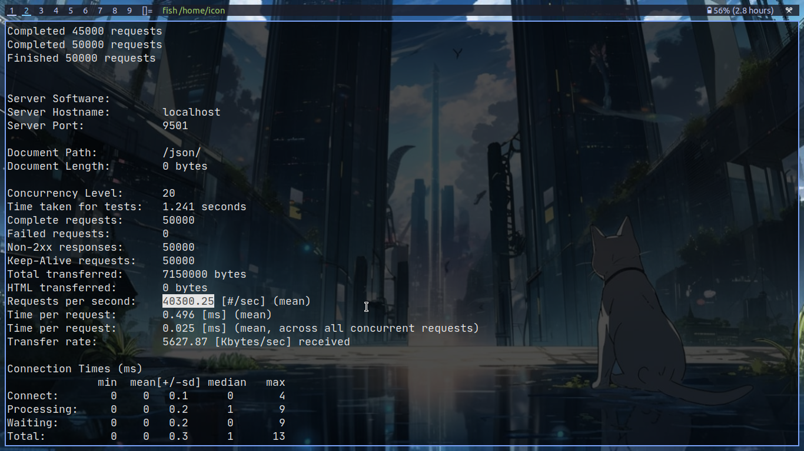
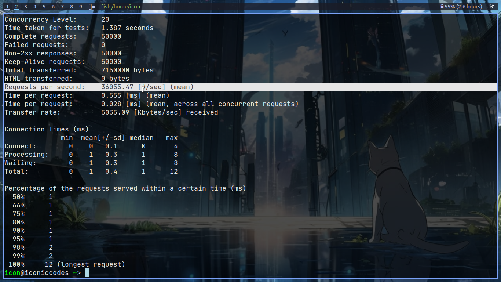

# NthPHP Framework


NthPHP is a fast, optimized PHP framework designed to speed up and simplify web development using automatic routing and providing great developer experience. Not only it can run in a traditional PHP environment with **Apache**, **Nginx**, **LiteSpeed**, or any other similar web server, but also it provides high performance, leveraging **Swoole** for asynchronous, coroutine-based processing, allowing your application to handle thousands of requests concurrently without requiring any changes in code.


## Screenshots





Built around a clean and minimal architecture, NthPHP uses PHP attributes for routing, automatic routing for Blade views, a flexible Blade templating engine for views, and a powerful ORM (RedBeanPHP) for database access. With built-in support for middleware and an easy-to-use configuration system, it simplifies common tasks like request handling, email sending, and validation.

## Key Features

- **Fast & Optimized**: NthPHP is built for speed, providing an efficient routing system and optimized performance.
- **PHP Attributes for Routing**: Routes are defined using PHP attributes, allowing for a clean, modern approach to routing.
- **Automatic Routing**: Routes are automatically collected from controllers, reducing the need for manual route registration.
- **Blade Templating**: Uses **BladeOne** as the templating engine, with automatic routes generation from views stored in a specific folder (`/app/Views/_pages`).
- **RedBeanPHP**: Uses **RedBeanPHP** for database interactions. No need for models, but models can be used if desired.
- **Swoole Integration**: NthPHP can utilize **Swoole** for asynchronous, coroutine-based performance, dramatically improving scalability and handling of concurrent requests. It can run in **Swoole** for better performance without changing the core code base.
- **Compatibility with Apache/Nginx/LiteSpeed**: NthPHP is fully compatible with traditional web servers like **Apache**, **Nginx**, and **LiteSpeed**. Whether you deploy on **Swoole** for concurrency and performance boosts or use a traditional web server, the same code works seamlessly across all environments, making the framework extremely flexible.

## Configuration

The configuration is stored in `app/config.php` and includes settings for routing, controllers, views, server config etc. NthPHP provides a class `Config` to read the config with dot notation, with `Config::get` method to read the configuration.

```
    $baseUrl = Config::get('app.base_url');
```

### Automatic Views Directory

The framework uses **Blade** templating with the default directory for views located at `/app/Views`.

In routing, if `automatic_routes` have value other than `false`, e.g,
```
    'automatic_routes' => ['_pages', '_other_dir_in_views' ]
```
then blade view files in  `/app/Views/_pages` and `_other_dir_in_views`, are considered as routes.

## Manual Routes

It is possible to define own routes in `app/Routes` directory. A php file here, must return an array of route arrays. A route array has following keys:

-**method**  
-**path**  
-**handler**  
-**middleware**  

Check demo files for example.

If file name is root.php, then routes of that and mounted with group. For other name, such as `demos.php`, any route define in it will automatically prepend `demos` in routes. 

## Documentation

- **Blade**: [Laravel Blade Documentation](https://laravel.com/docs/8.x/blade)
- **BladeOne**: [BladeOne GitHub Repository](https://github.com/EFTEC/BladeOne)
- **RedBeanPHP**: [RedBeanPHP Documentation](https://redbeanphp.com/)

## Installation

1. Clone the repository or download the framework.
2. Run `composer install` to install the required dependencies.
3. Configure your database and other settings as needed.
4. Start developing your application by creating controllers and views.

## Usage

1. Define routes in your controllers using PHP attributes.

```
#[Route(method, uri, middleware)]

#[Route(['GET', 'POST'], '/user/{name}', [AuthMiddleware::class])]

```

2. Views in `app/views/_pages` are automatically rendered based on routes, with Blade templating.

3. Database interactions can be handled using **RedBeanPHP**, with or without models.

4. The framework can run on **Swoole**, **Apache**, **Nginx**, **LiteSpeed**, or any other similar server environment without any changes to your code.

```
php server.php
```

## Caching

Please note that when routes are changed, and caching is set to true in the config, please delete `cache/routes/collector.cache` and `cache/routes/routes.cache` files.

## Developer

This framework is developed by **Nabeel Ali**. You can connect with the developer on LinkedIn:

- [Nabeel Ali](https://linkedin.com/in/nabeelalihashmi)
- Co-Founder and Creator of [Aliveforms]('https://aliveforms.com')
- Founder and Creator [Quizrella]('https://quizrella.com')

---

This is just the beginning. NthPHP is a work in progress and continuously evolving.
